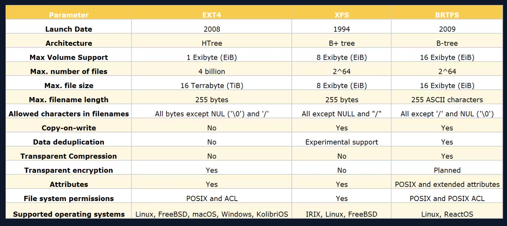

## [Linux File System Types](https://blog.learncodeonline.in/understanding-linux-file-systems-ext4-xfs-btrfs)

- **ext4**: The fourth extended filesystem (ext4) is widely used in Linux and known for its stability and support for large file sizes and volumes. It features journaling, which helps protect the integrity of the file system structure and speeds up crash recovery.

- **xfs**: XFS is designed for high performance and scalability, optimized for large data volumes and parallel I/O operations. It's often the choice for data-heavy applications and databases.

- **btrfs**: The B-tree filesystem (Btrfs) introduces advanced features like copy-on-write, snapshots, and dynamic inode allocation. It's geared toward fault tolerance, repair, and easy administration.

- **FAT32**: A file system compatible with many operating systems. FAT32 is often used for USB flash drives and other external devices but has limitations like a maximum file size of 4GB.

- **exFAT**: Extended File Allocation Table (exFAT) is optimized for flash memory like USB sticks and SD cards, supporting larger file sizes and volumes compared to FAT32.

- **NTFS**: While primarily used by Windows systems, NTFS can be read and, with the right software, written on Linux. It supports large files and has features like file compression and encryption.

- **swap**: Not exactly a file system for storing files, but a special type used by Linux swap partitions. It is used for paging and swapping data from memory to disk.

  

